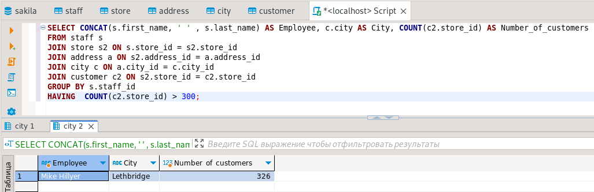
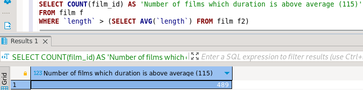
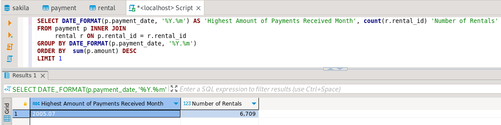

# 12-03_sql_part2

# Домашнее задание к занятию «SQL. Часть 2»

Задание можно выполнить как в любом IDE, так и в командной строке.

---

### Задание 1

Одним запросом получите информацию о магазине, в котором обслуживается более 300 покупателей, и выведите в результат следующую информацию: 
- фамилия и имя сотрудника из этого магазина;
- город нахождения магазина;
- количество пользователей, закреплённых в этом магазине.

**Решение**:
```
SELECT CONCAT(s.first_name, ' ' , s.last_name) AS Employee, c.city AS City, COUNT(c2.store_id) AS Number_of_customers
FROM staff s
JOIN store s2 ON s.store_id = s2.store_id
JOIN address a ON s2.address_id = a.address_id
JOIN city c ON a.city_id = c.city_id
JOIN customer c2 ON s2.store_id = c2.store_id
GROUP BY s.staff_id
HAVING  COUNT(c2.store_id) > 300;
```

<kbd></kbd> 

---

### Задание 2

Получите количество фильмов, продолжительность которых больше средней продолжительности всех фильмов.

**Решение**:
```
SELECT COUNT(film_id) AS 'Number of films which duration is above average (115)'  
FROM film f
WHERE `length` > (SELECT AVG(`length`) FROM film f2)
```
<kbd></kbd>

---

### Задание 3

Получите информацию, за какой месяц была получена наибольшая сумма платежей, и добавьте информацию по количеству аренд за этот месяц.

**Решение**:
```
SELECT month(p.payment_date) AS 'Highest Amount of Payments Received Month', count(r.rental_id) 'Number of Rentals'
FROM payment p INNER JOIN 
     rental r ON p.rental_id = r.rental_id 
GROUP BY  month(payment_date)
ORDER BY  sum(p.amount) DESC
LIMIT 1
```
<kbd></kbd>
